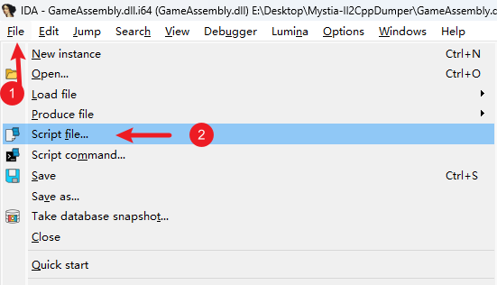
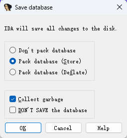

# 开发入门

本指南面向熟悉C#和.NET、但可能没有Unity IL2CPP Mod开发经验的贡献者，说明当前仓库的编译配置和基础逆向工具。

## 编译项目

在开始之前，请确保您的系统满足以下条件，并按顺序完成配置。

1. **.NET 10 SDK**：
   [https://dotnet.microsoft.com/zh-cn/download/dotnet/10.0](https://dotnet.microsoft.com/zh-cn/download/dotnet/10.0)

2. 一份《[东方夜雀食堂](https://store.steampowered.com/app/1584090)》的**合法拷贝**（Steam版本）。

3. 克隆**MetaMystia**仓库：
   [https://github.com/MetaMystia/MetaMystia](https://github.com/MetaMystia/MetaMystia)

4. 下载最新的**BepInEx-Unity.IL2CPP-win-x64**：
   [https://builds.bepinex.dev/projects/bepinex_be](https://builds.bepinex.dev/projects/bepinex_be)

    并将其完整解压至游戏的安装根目录（即`Touhou Mystia Izakaya.exe`所在目录）。

5. 启动游戏一次，在进入主菜单后退出。BepInEx会生成`core`、`interop`等项目编译需要的程序集。

6. 在MetaMystia仓库根目录复制本地配置模板：

    ```powershell
    Copy-Item MetaMystia.local.props.example MetaMystia.local.props
    ```

7. 编辑`MetaMystia.local.props`，把`BepInExPath`设为游戏目录中的`BepInEx`文件夹：

    ```xml
    <Project>
      <PropertyGroup>
        <BepInExPath>游戏安装目录\BepInEx</BepInExPath>
      </PropertyGroup>
    </Project>
    ```

    `MetaMystia.local.props`匹配仓库的`*.local.props`忽略规则，不应提交。项目通过该路径引用`BepInEx/core`和`BepInEx/interop`中的程序集，并把构建产物输出到`BepInEx/plugins`。

8. 使用支持.NET Solution的IDE打开`MetaMystia.sln`，或在仓库根目录执行：

    ```powershell
    dotnet build MetaMystia.sln
    ```

9. 构建会生成`BepInEx/plugins/MetaMystia-v<版本>.dll`，并把项目附带的`Il2CppInterop.HarmonySupport.dll`复制到`BepInEx/core`。如果该核心补丁发生变化，关闭所有游戏进程后重新启动游戏。

主项目目标框架是.NET 6.0，当前使用C# 14语法，因此开发环境安装.NET 10 SDK。源生成器项目目标框架为.NET Standard 2.0。

## 安装工具

为了进行较为高效的Mod开发和逆向分析，建议提前准备以下工具。

### 核心工具

#### IDA Pro

用于对`GameAssembly.dll`进行反汇编分析，并在必要时进行动态调试。对于IL2CPP游戏，IDA可用于检查本地代码的控制流和调用关系。

- 官方网站：[https://hex-rays.com/ida-pro](https://hex-rays.com/ida-pro)

> [!NOTE]
> IDA Free可以完成基础分析，但和Pro版本的功能和插件支持不同。请根据所需功能选择合法授权版本；本文不提供任何破解或规避授权的方式。

#### dnSpyEx

用于静态分析.NET程序集。在IL2CPP场景下，主要用于查看Il2CppDumper生成的Dummy DLL，以理解类结构、字段布局和方法签名。原`dnSpy/dnSpy`仓库已经归档，这里使用仍在维护的dnSpyEx分支。

- GitHub仓库：[https://github.com/dnSpyEx/dnSpy](https://github.com/dnSpyEx/dnSpy)

#### Il2CppDumper

用于分析IL2CPP生成的二进制文件，还原符号信息，并生成供dnSpy和IDA使用的辅助文件。

- GitHub仓库：[https://github.com/Perfare/Il2CppDumper](https://github.com/Perfare/Il2CppDumper)

### 推荐插件（可选）

#### IDA-Pro-MCP

该插件允许AI Agent通过MCP接口访问IDA数据库，可用于辅助定位函数、理解控制流或加速分析过程。

- 安装参考：[https://github.com/mrexodia/ida-pro-mcp?tab=readme-ov-file#installation](https://github.com/mrexodia/ida-pro-mcp?tab=readme-ov-file#installation)

#### dnSpy.Cpp2IL

dnSpy插件，用于将Cpp2IL的分析结果整合进dnSpy视图，在查看IL2CPP还原代码时提供更多信息。安装前请按插件仓库说明确认和所用dnSpy版本兼容。

- 安装参考：[https://github.com/BadRyuner/dnspy.Cpp2IL?tab=readme-ov-file#how-to-install](https://github.com/BadRyuner/dnspy.Cpp2IL?tab=readme-ov-file#how-to-install)

## 逆向分析准备

本节介绍如何利用上述工具准备IL2CPP分析环境。完成后，可以在dnSpy中浏览还原的类型结构，并在IDA中进行带符号的反汇编分析。

### 使用Il2CppDumper还原符号

1. 运行`Il2CppDumper.exe`。

2. 按照提示依次加载以下文件：
    - 游戏目录下的`GameAssembly.dll`
    - `Touhou Mystia Izakaya_Data/il2cpp_data/Metadata/global-metadata.dat`

3. 等待工具完成自动分析。完成后将生成多个输出目录，其中后续步骤主要使用：
    - `DummyDll/`

### 导入dnSpy

1. 将Il2CppDumper生成的`DummyDll/Assembly-CSharp.dll`导入dnSpy。

2. 通过该文件，您可以较为直观地查看游戏逻辑中的类定义、字段名称以及方法签名，并定位其在dll中的虚拟地址。

### 导入IDA Pro

1. 使用IDA Pro打开`GameAssembly.dll`，等待其完成初始自动分析（首次加载耗时可能较长）。

2. 在IDA中点击`File -> Script file`，运行Il2CppDumper生成的`ida_with_struct.py`脚本。部分版本会把Python 3版脚本命名为`ida_with_struct_py3.py`，请以实际输出文件为准。

3. 根据脚本提示，依次选择生成的`script.json`和`il2cpp.h`文件，耐心等待符号和结构信息导入完成。

    

4. 导入完成后，关闭IDA并**保存数据库**。在保存对话框中，建议勾选`Collect`选项，以保留完整的分析信息。

    

5. 额外备份生成的`GameAssembly.dll.i64`数据库文件

> [!TIP]
> 动态调试时由于**ASLR**，模块的运行时基址（如`0x7FFF25021000`）会和静态分析时的地址（如`0x180001000`）不同，容易造成地址对照混乱。保留一份原始静态数据库可以避免IDA的Rebase影响静态分析。

### 辅助Skill

AI Agent可以辅助搜索调用关系和整理审计记录，但游戏行为仍应由逆向代码、Interop程序集和实际运行结果交叉验证。需要通过IDA Pro MCP进行IL2CPP源码还原时，可参考[il2cpp-to-csharp-skill](https://github.com/MetaMikuAI/il2cpp-to-csharp-skill)。
