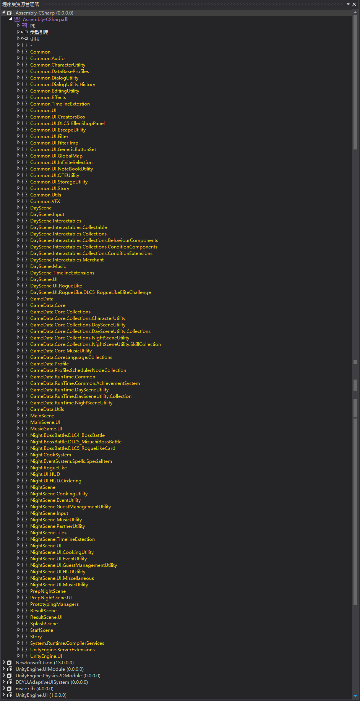
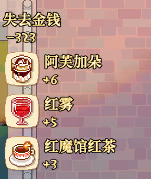
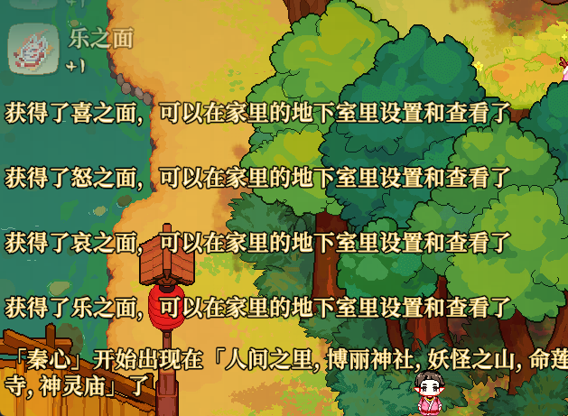
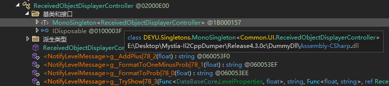
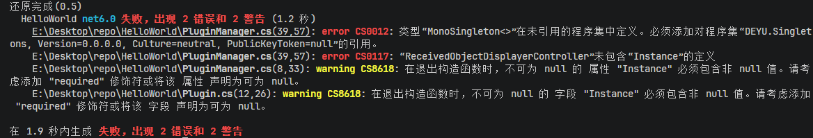

# Hello World 其二

本节通过一个具体示例，介绍如何审计游戏逻辑并寻找所需的函数入口。示例不能直接套用到所有游戏，但“根据可见行为提取线索，再用类型、签名和调用关系验证”的方法具有通用性。这里的目标是找到《东方夜雀食堂》中显示左下角通知的函数，并让它显示`Hello World!`。

## 前提

在开始之前，请确保您已经完成[开发入门](./getting_started.md)中的全部内容。游戏逻辑的审计难度会受到原游戏架构、命名习惯、编译器优化和代码混淆等因素影响。《东方夜雀食堂》的类型和成员命名保留得较为清晰，因此可以从界面表现、调用关系和类型名称逐步缩小范围。审计结果仍应结合反编译结果、Interop程序集和实际运行验证。

## 整体审计

开始定位前，先观察项目的命名习惯和模块划分。《东方夜雀食堂》的相关类型主要分布在`Common`、`DayScene`、`GameData`、`MainScene`和`NightScene`等命名空间中。UI相关类型常包含`UI`，DLC相关类型常包含`DLCx`，游戏数据主要集中在`GameData`。



## 游戏逻辑分析

定位一个功能时，先记录它的触发条件、输入输出和可能的调用位置。对于左下角通知，可以得到以下线索：

1. 需要一个字符串作为输入。
2. 多条通知会同时展示，并有先后次序和各自的生命周期。
3. 通知常常在任务开始、任务结束等节点出现，可以从这些调用位置反向查找显示函数。
4. 除了纯文本通知外，还会出现带图标的通知；这些功能可能共用底层显示组件，可以沿相邻类型和重载继续查找。
5. 该通知不仅存在DayScene，也会在NightScene中出现。






## 代码审计

根据这些线索，可以按以下方向搜索：

1. 和UI有关，可能是命名空间含有`UI`的类。
2. 和通知有关，可能是命名空间含有`Notify`、`Message`、`Toast`等的类。
3. 和场景无关，可能是既在DayScene又在NightScene中，或直接在Common中。
4. 会有很多变种，可以单独输入字符串，也可能输入多种参数来展示不同的通知。
5. 有多种调用情况，如果熟悉其他通知的触发条件和调用关系，可以根据查找调用关系来确认。

在当前分析结果中，目标类型是`Common.UI.ReceivedObjectDisplayerController`，成员函数`NotifyTextMessage`的签名为`public void NotifyTextMessage(string content)`。



该类型继承自`DEYU.Singletons.MonoSingleton<Common.UI.ReceivedObjectDisplayerController>`，可以通过其`Instance`属性取得实例并调用成员函数。

为进行测试，我们在`PluginManager.Update`中添加如下代码：

```csharp
if (Input.GetKeyDown(KeyCode.F2)) // 按下 F2 键
{
	Common.UI.ReceivedObjectDisplayerController.Instance.NotifyTextMessage("Hello World!");
}
```



编译时会出现以下错误：

> error CS0012: 类型“MonoSingleton<>”在未引用的程序集中定义。必须添加对程序集“DEYU.Singletons, Version=0.0.0.0, Culture=neutral, PublicKeyToken=null”的引用。

因此我们继续添加引用`BepInEx/interop/DEYU.Singletons.dll`，并重新编译。编译成功后，启动游戏，按<kbd>F2</kbd>键，即可看到左下角成功弹出了我们的Hello World通知。


## Hook辅助

如果难以直接调用函数，也可以使用`HarmonyPatch`添加Hook，并通过日志确认目标函数是否在预期时机执行。Hook位置和`Prefix`、`Postfix`的选择必须依据实际调用链，不能只根据函数名判断。

## AI辅助

AI可以辅助搜索候选类型、整理调用关系和生成审计笔记，但给出的成员名、签名和调用结论都需要用逆向代码、Interop程序集或实际运行结果验证。
