# 皮肤系统

皮肤系统可以替换本地角色外观，并把选择同步给房间内其他玩家。它支持游戏原有角色和服装、DLC、ResourceEx角色和服装，以及从皮肤站下载的网络皮肤。

## 游戏和ResourceEx皮肤

先执行`/skin list`查看当前环境中可用的角色ID、类型和索引，再使用：

```text
/skin set <characterId> <Default|Explicit|DLC> <skinIndex>
```

例如：

```text
/skin set 21 Explicit 0
```


拥有对应DLC时，也可以选择DLC角色：

```text
/skin set 2006 Default 0
```


执行`/skin off`会清除手动覆盖并恢复游戏默认外观。皮肤会在联机中同步，但其他玩家必须拥有对应的游戏、DLC或ResourceEx资源，才能正确显示本地资源皮肤。

## 网络皮肤

网络皮肤由皮肤站按名称下载：

```text
/skin net <name>
```

下载完成前会先显示占位外观。`/skin net refresh`会清除当前皮肤缓存并重新下载，`/skin net off`关闭网络皮肤。

当前文档记录的名称如下；皮肤站实际提供的内容可能随时调整。

|   名称    |                 预览                  |
| :-------: | :-----------------------------------: |
| `DMShion` | 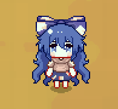 |
| `DMJyoon` | 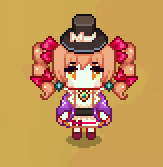 |
| `DMUrumi` | 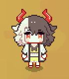 |
|   `Box`   |     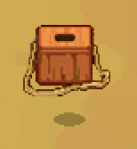     |
|  `Ball`   |    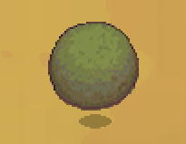    |
|   `AQ`    |      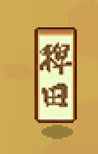      |
|   `Bun`   |     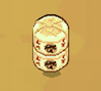     |
|  `Stone`  |   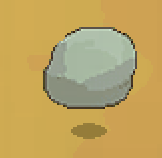   |
|   `Cat`   |     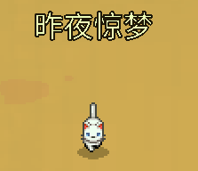     |
|   `Dog`   |     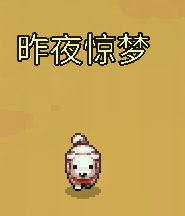     |
| `Kedama`  |  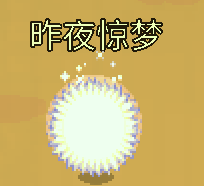  |

## 旋转覆盖

部分贴图需要覆盖角色旋转行为：

```text
/skin rot on
/skin rot off
/skin rot clear
```

`clear`会清除手动覆盖，并立即恢复皮肤或游戏自身的旋转设置。

完整命令说明参见[常用命令](./commands.md)。
